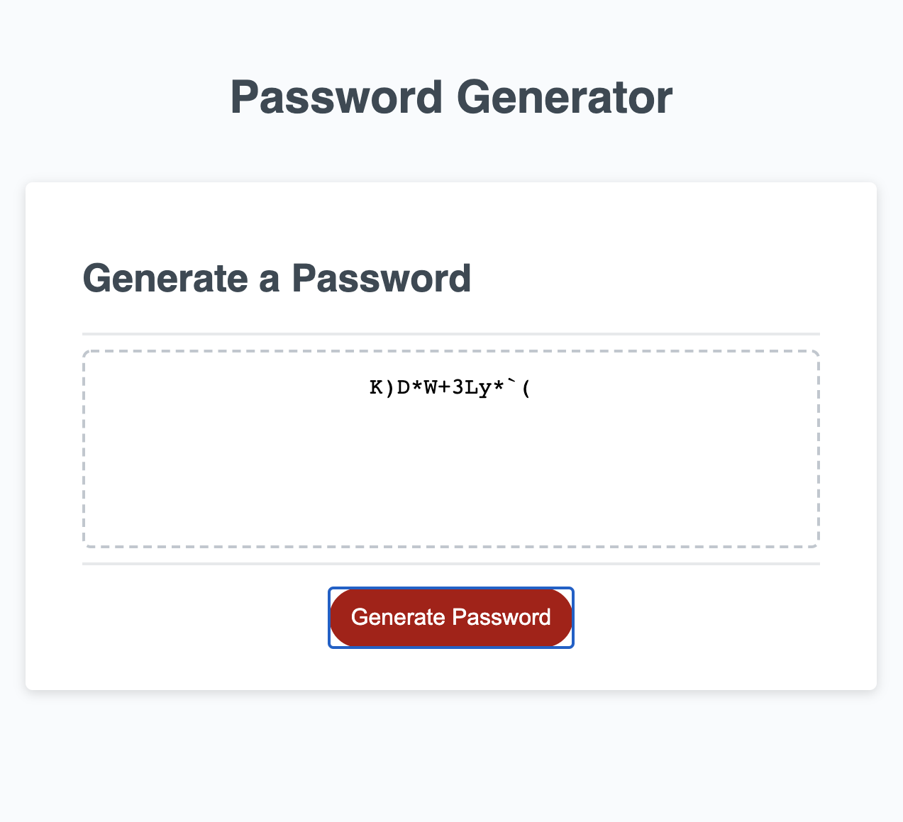

# random-password-generator

This is a homework assignment for Case Western Reserve University Coding Bootcamp. The purpose of this assignment is to make a website that generates a random password based off of a specific set of criteria. The user chooses the length of their password, and then selects if they want to use upper case letters, lower case letters, numbers, and/or symbols.

Links to websites:

https://github.com/michellew179/random-password-generator/

https://michellew179.github.io/random-password-generator/

Screenshot of website:

